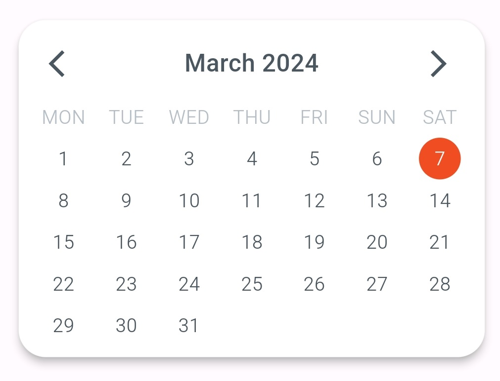

# CalenDart Flutter Package

## Overview
The "Awesome CalenDart" Flutter package offer a calendar widget designed to enhance your Flutter applications with a stylish and functional calendar display. </br>
The package provides the AwesomeCalenDart class, which can be easily integrated into your Flutter projects.

* Light Mode:
<p align="center" width="100%">
    
</p>

* Dark Mode: </br>
* <p align="center" width="100%">
    
</p>

## Usage
### Import the package

```dart
import 'package:awesome_calendart/awesome_calendart.dart';
```

### Instantiate the AwesomeCalenDart widget

```dart
AwesomeCalenDart(
  isDarkMode: true,
  borderRadius: 16.0,
  elevation: 4.0,
),
```

## Parameters

- isDarkMode (optional): A boolean parameter indicating whether the calendar should use a dark mode theme. If true, the calendar will be styled with a dark color scheme; otherwise, it will use a light color scheme. Default is false.
- borderRadius (optional): A double parameter specifying the border radius of the calendar widget. This controls the rounded corners of the calendar. Default is 8.0.
- elevation (optional): A double parameter representing the elevation of the calendar. This controls the shadow effect beneath the calendar. Default is 2.0.

